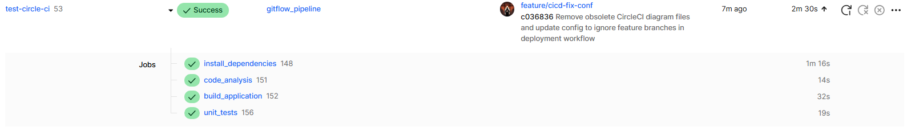
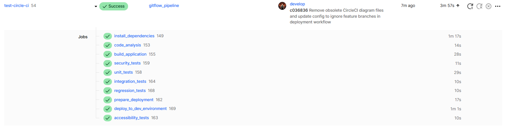
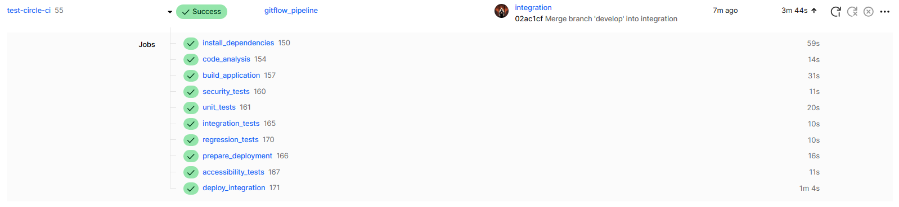
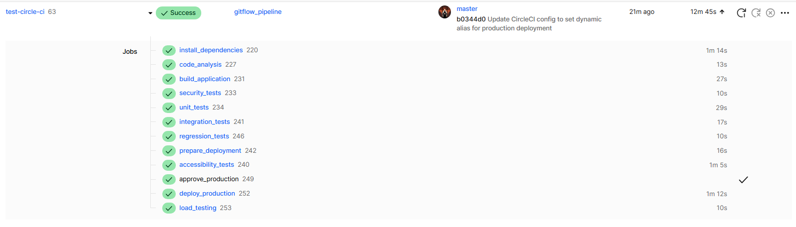
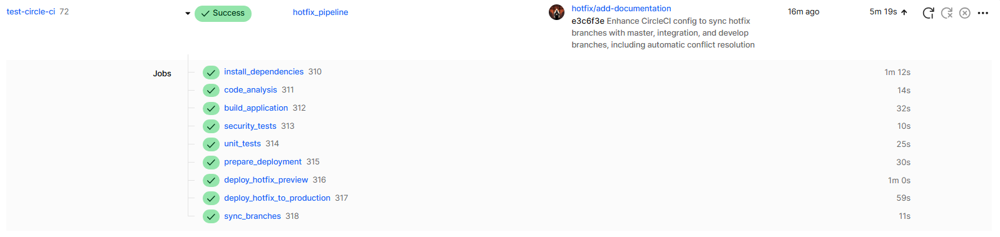

# Documentation technique pour l'évaluation

## 1. Gestion des branches
Notre projet utilise la méthodologie GitFlow avec les branches suivantes:

- **`master`**: Code en production, toujours stable
- **`develop`**: Branche principale de développement
- **`integration`**: Branche intermédiaire pour l'intégration et les tests
- **`feature/*`**: Nouvelles fonctionnalités
- **`hotfix/*`**: Corrections urgentes pour la production

Pour plus de détails, voir la [section Stratégie de branchage GitFlow](./README.md#-stratégie-de-branchage-gitflow) du README principal.

## 2. Workflow de travail et description technique des jobs

### Workflow Agile
Notre équipe travaille en méthodologie Scrum avec:
- Sprints de 2 semaines
- Daily standups à 9h30
- Revue de sprint et rétrospective en fin de sprint
- Backlog refinement hebdomadaire

Le flux de développement suit ces étapes:
1. Sélection des user stories du backlog pour le sprint
2. Création des branches feature pour chaque user story
3. Développement avec TDD/BDD sur les branches feature
4. Revue de code via Pull Requests
5. Merge dans develop après validation
6. Déploiement automatique sur l'environnement de développement
7. Tests d'intégration et d'acceptation sur l'environnement d'intégration
8. Déploiement en production après approbation

### Jobs techniques
Notre pipeline CircleCI comprend les jobs suivants:

- **Build**: `install_dependencies`, `code_analysis`, `build_application`
- **Test**: `unit_tests`, `integration_tests`, `regression_tests`, `accessibility_tests`, `security_tests`
- **Déploiement**: `prepare_deployment`, `deploy_development`, `deploy_integration`, `deploy_production`

Ces jobs sont décrits en détail dans la [section Pipeline CI/CD](./README.md#-pipeline-cicd) du README.

## 3. Pipelines exécutés

### Pipeline sur branche feature

*Ce pipeline exécute les tests unitaires et l'analyse de code, sans préparer de déploiement.*

### Pipeline sur branche develop

*Ce pipeline déploie automatiquement vers l'environnement de développement après les tests.*

### Pipeline sur branche integration

*Ce pipeline exécute tous les tests et déploie vers l'environnement d'intégration.*

### Pipeline sur branche master

*Ce pipeline exécute tous les tests, puis après approbation manuelle, déploie directement en production sans étape intermédiaire.*

### Pipeline sur branche hotfix

*Ce pipeline accéléré permet de tester et déployer rapidement des correctifs critiques. Après une prévisualisation rapide, le correctif est automatiquement déployé en production sans étape d'approbation. Il est ensuite automatiquement synchronisé avec les branches `integration` et `develop` pour maintenir la cohérence du code entre tous les environnements.*

## 4. Liens
- [Répertoire GitHub public](https://github.com/solutionsSlayer/with-jest-circle-ci)
- [Application de développement](https://nextjs-calculator-dev-develop.vercel.app)
- [Application d'intégration](https://nextjs-calculator-integration.vercel.app)
- [Application de production](https://nextjs-calculator-solutionsslayer.vercel.app)
